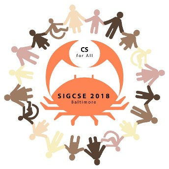

It's 2018 (seems like yesterday…) and the 49th Technical Symposium was held February 21-24, 2018 in Baltimore, Maryland.  The Conference Chairs were Tiffany Barnes (North Carolina State University) and Dan Garcia (University of California Berkeley).  The Program Chairs were Manuel A. Perez-Quinones (University of North Carolina Charlotte) and Elizabeth "Beth" Hawthorne (Union County College). 

The theme for SIGCSE 2018 was CS for All, expanding our community and leadership to include everyone, across different groups, educational levels (K-12 to college and beyond), places, and institution types. In 2017, we introduced reviewer discussions and expanded the associate program committee (APC) from 12 to 56 members. In 2018, we established three paper submission tracks, recognizing the differences in scope and review criteria between (1) CS education research and practice, (2) experience reports and tools, and (3) new curricula, programs, degrees, and position papers.

SIGCSE 2018 had the largest program in its history, with 17 parallel tracks! There were 459 papers submitted (!) with 161 acceptances 
for a 35% acceptance rate. Full submission statistics are here:

In addition, there were a TOCE and Sister conferences track to launch a new model of “cross-fertilization” opportunities for the SIGCSE community. There were 15 TOCE papers, and invited presentations by SIGCAS, SIGGRAPH, SIGHPC, SIGITE, SIGCHI, SIGPLAN, and RESPECT. For the first time, “Nifty Assignments” (a SIGCSE favorite, eighteen years running) became its own official track and a new conference committee position was added: Puzzles, Social, & Board Games to coordinate activities, games and puzzles to help us connect with other participants and have fun together.  We awarded 9 Best Papers representing the top three papers in each track.

The Outstanding Contribution to Computer Science Education Award was given to Tim Bell for significant and lasting impact on computing education internationally through the development of innovative resources and activities, such as "CS Unplugged", that inspire and engage students and teachers at all educational levels.

The Lifetime Service to Computer Science Education was awarded to Eric Roberts for outstanding service to computing education, making significant contributions to computing curricula and pedagogy, and generously sharing his knowledge and wisdom through mentoring and guidance to others in the computing education community. You can listen to an interview with Eric through the Computing Educators Oral History Project [here:](http://ahab.southwestern.edu/departments/mathcompsci/OHProject/robertsE-overview.html.)

From Andy Rasmussen: A group of 20 people from Chicago Public Schools - the strongest representation from a K-12 school system. Click [here](https://urldefense.proofpoint.com/v2/url?u=https-3A__photos.app.goo.gl_JcuTH5mZBCmRBcSz5&d=DwMFaQ&c=Cu5g146wZdoqVuKpTNsYHeFX_rg6kWhlkLF8Eft-wwo&r=jRqTUbcXe97L1lhtfOsFQx0SWK8AdZ2TdL8PpZWev9Y&m=XvcEBW91uZWYSNnWLoKpDeczoQQX7gPBRuS1-MvU67I&s=8EX7zWaJdpx5X-G5q2IopDwacsDB7lj6akxDy3MdWxc&e=) for animated version.

The 23rd ITiCSE conference was held July 2-4, 2018 in Larnaca, Cyprus. The Conference Chairs were Irene Polycarpou (University of Central Lancashire, Cyprus) and Janet C. Read (University of Central Lancashire, UK).  The Program Chairs were Panayiotis Andreou (University of Central Lancashire, Cyprus) and Michal Armoni (The Weizmann Institute of Science, Israel).  The conference continued to be international with 247 submissions and a total of 617 authors from 47 countries on all continents, representing institutions from Africa (8), Asia (55), Europe (223), North America including Central America and the Caribbean (238), Oceania (44), and South America (48). A total of 193 papers, one panel, 25 posters, 15 tips and techniques, and 14 working groups were submitted. This year, 56 papers (29%) were selected for presentation and inclusion in the proceedings. There were 21 posters and 9 tips and techniques submissions accepted along with 9 working groups. 

The 12th ICER conference was held August 13-15, 2018 in Espoo, Finland.  The Program Chairs were Lauri Malmi (Aalto University) and Robert McCartney (University of Connecticut).  The Site Chairs were Ari Korhonen (Aalto University) and Andrew Petersen (University of Toronto Mississauga).  They were all considered to be General Chairs of the conference.  There were 125 research papers were submitted, with 28 papers accepted for publication (a 22% acceptance rate).

The 22nd Doctoral Consortium was once again co-located with ICER and held on August 12, 2018 with 19 participants. It was led this year by Jan Vahrenhold (Westfälische Wilhelms-Universität) and Andrew J. Ko (University of Washington). The discussants were Brian Dorn (University of Nebraska Omaha), Anna Eckerdal (Uppsala University), Kate Sanders (Rhode Island College), David Weintrop (University of Maryland) and Aman Yadav (Michigan State University).
From the Bulletin (SIGCSE Bulletin, Vol. 50, No. 4 Oct 2018):  SIGCSE Launches New Conference on a Global Scale ACM Global Computing Education Conference, also known as ACM CompEd. This new event is destined to become a leading global conference on computing education. At the intersection of computing and the learning sciences, the CompEd seeks to promote global computing education development. The plan is to hold CompEd every two years in parts of the world not regularly served by SIGCSE conferences. The first CompEd conference will take place in Chengdu, China, 17-19 May 2019.
