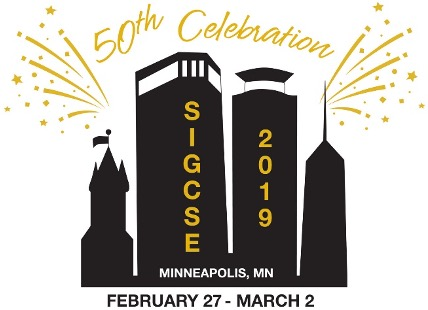
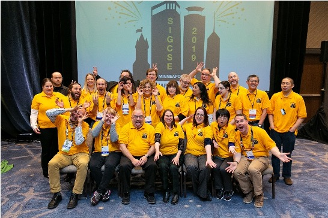
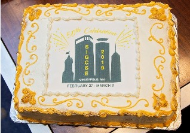
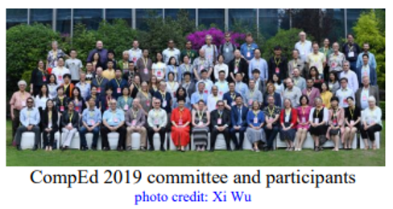
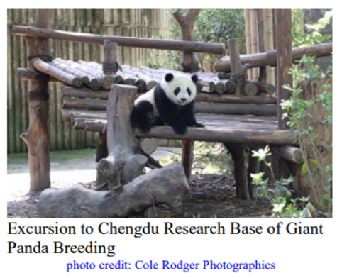

Thanks for following along in this journey through SIGCSE's history. In the fifty years since SIGCSE was created it has grown to 2700 members from around the globe and now sponsors FOUR successful computing education conferences, a doctoral consortium, two annual awards, and many other activities and events.  

SIGCSE celebrated its 50th Technical Symposium in Minneapolis, Minnesota, USA from February 27 to March 2, 2019. The Conference Chairs were Elizabeth K. Hawthorne (Union Country College) and Manuel A. Pérez-Quiñones (University of North Carolina at Charlotte). The Program Chairs were Sarah Heckman (North Carolina State University) and Jian Zhang (Texas Woman’s University).

The theme was “Celebrating the 50 Technical Symposia” and the conference contained many different celebrations, including a walk of past symposia chairs, birthday cake, and even a history track.  One big innovation for SIGCSE 2020 was the increase in paper length to a full 6 pages of content and one page for references. The page increase on average provided an additional half page of content, a full page for references, and the opportunity for authors to fully situate their work within the broader literature. Additionally, we moved the Saturday keynote to first thing in the morning, leaving the closing lunch for recognitions and awards presentations.

In spite of the historic 30.4 inches of record snowfall during the month of February, the Golden Anniversary of the Technical Symposium broke another record with 1809 attendees! We also had a record number of submissions and acceptances. We received 994 submissions across all tracks from over 50 countries, with a total of 2668 unique authors representing over 800 organizations. Paper submissions (526) were up 15% over SIGCSE 2018. We accepted 169 papers across all three paper tracks (CS Education Research, Experience Reports & Tools, and Curricula Initiatives) which was up 5% over SIGCSE 2018, 18 panels, 15 special sessions, 30 workshops, 19 ACM Student Research Competition submissions, 30 Birds of a Feather, 11 Demos, 22 Lightning Talks, 6 Nifty Assignments, and 90 Posters. Papers received at least 5 reviews and all other submissions received at least 3 reviews. All 797 reviewers, along with 69 Associate Program Chairs and 14 Track Chairs, discussed submissions to come to a consensus on to help the Program Chairs select the papers that made up the SIGCSE 2019 technical program. Three best papers were awarded in each of the following categories: CS Education Research, Experience Reports and Tools, and Curricula Initiatives.

The Outstanding Contribution to Computer Science Education Award was given to Mark Guzdial for helping to create the field of computing education research, designing and evaluating innovative curricula and pedagogical methods, mentoring the field, and promoting computing as a literacy for all.

The Lifetime Service to Computer Science Education was awarded to 
Gloria Childress Townsend for seventeen years of dedicated service to ACM’s Council on Women in Computing, while transforming her vision for ACM Celebrations into a global project that supports thousands of women around the world.

The 24th ITiCSE conference was held July 15-17, 2019 in Aberdeen, Scotland.  The Conference Chairs were Bruce Scharlau (University of Aberdeen) and Roger McDermott (Robert Gordon University, UK).  The Program Chairs were Arnold Pears (KTH Royal Institute of Technology, Sweden) and Mihaela Sabin (University of New Hampshire). There were a record 243 papers submitted with 66 accepted (27%). Just over half of the papers had an author from the United States or Canada, and 40% of the papers had a European author.  In addition to the papers, Posters, Panels, Tips, Techniques & Courseware, and ten Working Groups were part of the conference.  Additionally, a Doctoral Consortium was held the weekend before the conference that was sponsored by the Scottish Informatics & Computer Science Alliance (SICSA).

The 15th ICER conference was held August 12-14, 2019 in Toronto, ON, Canada. The Program Chairs were Robert McCartney (University of Connecticut) and Anthony Robins (University of Otago, New Zealand).  The Site Chairs were Andrew Petersen (University of Toronto Mississauga, Canada) and Adon Moskal (Otago Polytechnic, New Zealand). There were 137 research papers were submitted, with 28 papers accepted for publication (a 20% acceptance rate). There were 151 attendees (including 70 first-timers and 46 students) from 13 countries – marking the highest attendance for an ICER outside of the US.

The 23rd Doctoral Consortium was once again co-located with ICER and held the day before ICER with 19 participants. It was led this year by Amy J. Ko (University of Washington) and Katrina Falkner (university of Adelaide). The discussants were Elizabeth Patitsas (McGill University), Colleen Lewis (Harvey Mudd University), Quintin Cutts (University of Glasgow) and Lauren Margulieux (Georgia State University). 

he very first CompEd Conference (formerly known as SIGCSE Global) was held in Chengdu, China on May 17-19, 2019. Conference Chairs were Ming Zhang (Peking University) and Bo Yang (Linyi University).  Program Chairs were Stephen Cooper (University of Nebraska Lincoln) and Andrew Luxton-Reilly (University of Auckland, New Zealand).  The first CompEd was co-located with two conferences, the ACM Turing Celebration Conference - China (ACM TURC) and SIGCSE China. CompEd 2019 had 99 attendees with an additional 55 who registered for both CompEd and TURC. The conference received submissions of 100 papers, 3 panels, 8 working group applications, 4 birds-of-a-feather sessions, and 10 posters. In total, more than 320 authors from 25 countries submitted work for review. From these submissions, 33 full papers (33%), 1 panel (33%), 3 working groups (38%), 2 birds-of-a-feather sessions (50%), and 8 posters (80%) were accepted. One of the highlights of this conference was the opportunity to see the Chengdu Research Base of Giant Panda Breeding./

In the January 2019 SIGCSE Bulletin (Vol. 51, No. 1), following approval by the ACM SIG Governing Board and ACM Awards Committee, the SIGCSE Board announced the creation of a special ACM approved SIG award to commemorate the 50th SIGCSE Technical Symposium: Top Ten Symposium Papers of All Time Award. The winners were announced at the 2019 Technical Symposium and printed in the April 2019 Bulletin (Vol. 51, No. 2). Nominations for papers were accepted from the community and the committee which narrowed the list down to 20 and the community voted for the top 10. Congratulations to “Identifying student misconceptions in programming” (2010) by Kaczmarczk, Petrick, East, and Herman!
From the Bulletin (SIGCSE Bulletin, Vol. 51, No. 2 2019): The SIGCSE Board is pleased to announce the creation of an ACM-approved SIG award, the SIGCSE Test of Time Award. This award will recognize an outstanding paper published in the SIGCSE community that has had meaningful impact on computing education practice and research.  The award will not be restricted to Technical Symposium papers; however, papers will need to have been published at least ten years prior to the award. Also in this Bulletin were the graphics for the Programming Language Mentions by Decade within Technical Symposium papers. 
A new Board was elected during 2019: The new Chair is Adrienne Decker (University at Buffalo). The new Vice Chair is Dan Garcia (University of California, Berkeley). The new Treasurer is Andrew Luxton-Reilly (University of Auckland, New Zealand. The new Secretary is Leo Porter (University of California, San Diego). The new Members At Large are Mary Anne Egan (Siena College), Laurie Murphy (Pacific Lutheran University), and Manuel A. Pérez-Quiñones (University of North Carolina at Charlotte). Amber Settle (DePaul University) served as Past Chair. Jeffrey Miller (University of Southern California) and Karen C. Davis (Miami University – Ohio) served as SIGCSE Bulletin co-editors.

